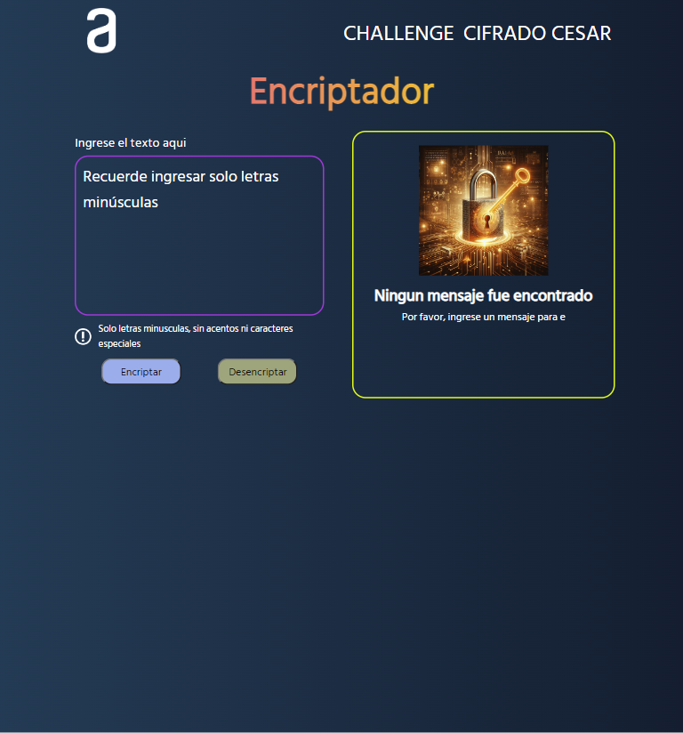
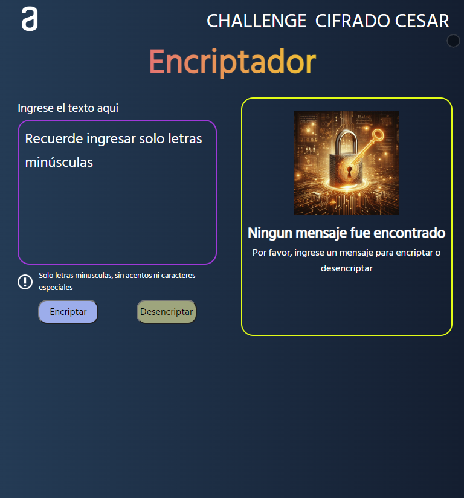
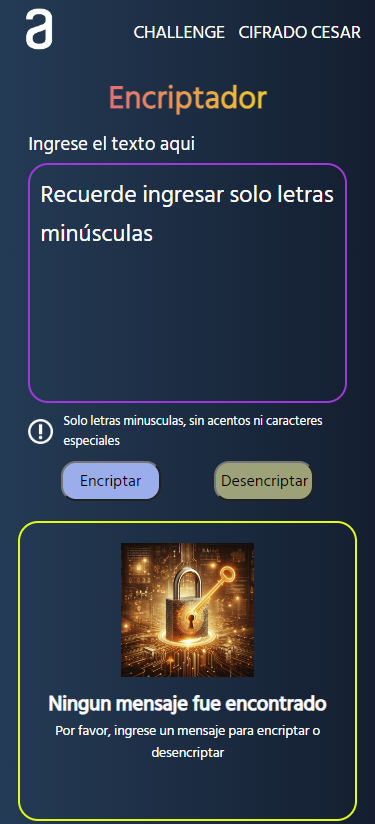

# Challenge Encriptador - Oracle Next Education

Este proyecto es el primer challenge del programa Oracle Next Education, que consiste en realizar un encriptador y desencriptador de texto.

## Sobre el challenge:

Las "llaves" de encriptación que utilizaremos son las siguientes:

- La letra "e" es convertida para "enter"
- La letra "i" es convertida para "imes"
- La letra "a" es convertida para "ai"
- La letra "o" es convertida para "ober"
- La letra "u" es convertida para "ufat"

### Requisitos:

- Debe funcionar solo con letras minúsculas
- No deben ser utilizadas letras con acentos ni caracteres especiales
- Debe ser posible convertir una palabra para la versión encriptada y también devolver una palabra encriptada para su versión original.

Por ejemplo:
- "gato" => "gaitober"
- "gaitober" => "gato"

La página debe tener campos para inserción del texto que será encriptado o desencriptado, y el usuario debe poder escoger entre las dos opciones.
El resultado debe ser mostrado en la pantalla.

## Extras:

- Un botón que copie el texto encriptado/desencriptado para la sección de transferencia, es decir, que tenga la misma funcionalidad que el ctrl+C o la opción "copiar" del menú de las aplicaciones.
- Se agregó un Cifrado Cesar en una página adicional.

<h1>Cifrado Cesar</h1>

Es una técnica de cifrado muy simple en la que cada letra del texto es reemplazada por otra letra que se encuentra un número fijo de posiciones más adelante en el alfabeto. Por ejemplo, con un desplazamiento de 3, la letra A se sustituiría por la D, la B se convertiría en E, y así sucesivamente.

## Sobre el cifrado cesar:
- El programa debe ser capaz de cifrar y descifrar mensajes
- El programa debe ser capaz de manejar tanto letras mayúsculas como minúsculas
- El programa debe ser capaz de manejar mensajes que contengan caracteres especiales, como espacios, signos de puntuación, etc.
- También cuenta con el botón de copiar.

# Características del proyecto

## Validación

- Para el challenge se utilizó una expresión regular que solo permite el ingreso de letras minúsculas, evitando que el usuario pueda ingresar mayúsculas, números o caracteres especiales.
- En el caso del Cifrado Cesar, se permite el ingreso de cualquier caracter.
- En ambos se utiliza una alerta en caso se quiera encriptar o desencriptar un texto vacío. Para lo cual se utiliza sweetalert2.

## Diseño Responsive

- Se utilizó media queries para darle un diseño responsive que se adapte al tamaño de la pantalla de los distintos dispositivos desde donde pueden acceder los usuarios.
- Algunas de estas vistas son:

### Laptop

### Tablet

### Móvil

## Accede al encriptador: 
https://jascmen.github.io/challenge-EncriptadorOne/

